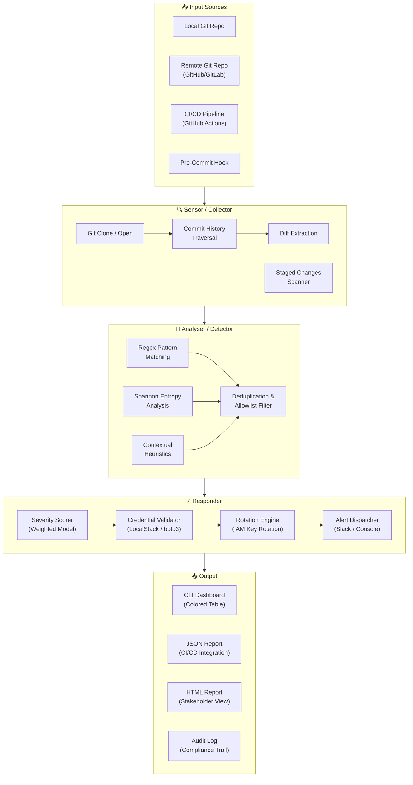
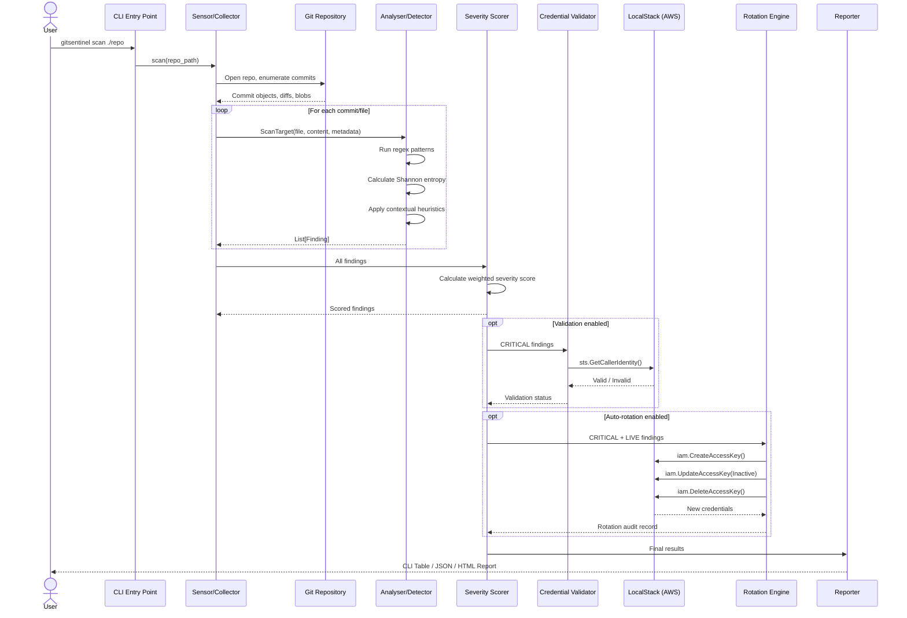
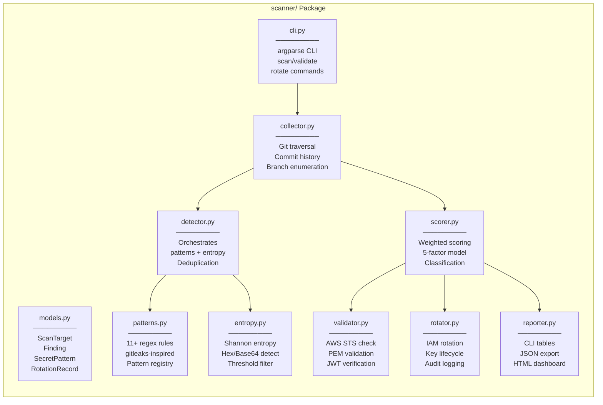
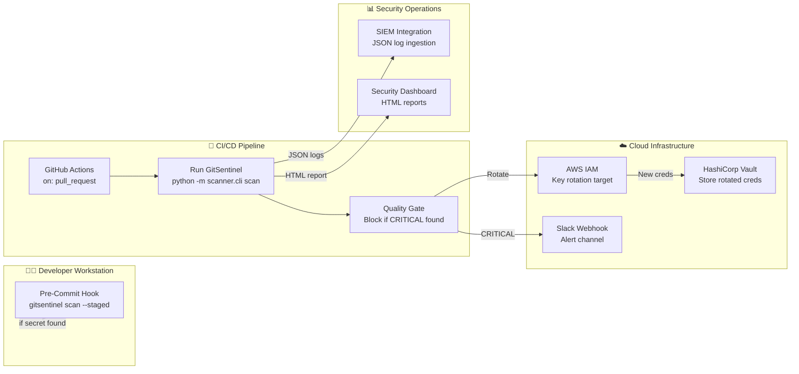

# 🏛️ GitSentinel — Architecture Document

## Overview

GitSentinel is a **defensive security tool** that sits at the **Application / Identity layer** of a cloud-native architecture. It integrates into the Software Development Lifecycle (SDLC) to detect and remediate secrets leaked into Git repositories.

---

## High-Level Architecture

---

## Data Flow

---

## Component Responsibilities

---

## Deployment Integration Points

---

## Technology Stack

| Layer | Technology | Purpose |
|-------|-----------|---------|
| **Language** | Python 3.10+ | Core application logic |
| **Git Integration** | GitPython | Repository traversal and history analysis |
| **Pattern Detection** | Python `re` (stdlib) | Regex-based secret pattern matching |
| **Entropy Analysis** | Python `math` (stdlib) | Shannon entropy calculation |
| **AWS Simulation** | LocalStack + boto3 | Credential validation and IAM key rotation |
| **Key Parsing** | `cryptography` | RSA/EC/DSA private key validation |
| **JWT** | `PyJWT` | JWT signing key verification |
| **CLI** | `argparse` + `colorama` + `tabulate` | Terminal interface and coloured output |
| **Reporting** | `jinja2` | HTML report template rendering |
| **CI/CD** | GitHub Actions | Automated scanning on pull requests |
| **Container** | Docker Compose | LocalStack orchestration |

---

## Security Considerations

1. **GitSentinel never exfiltrates secrets** — all processing is local; findings are reported with redacted values
2. **LocalStack isolation** — credential validation runs against a local simulation, never real cloud APIs
3. **Audit trail** — every rotation action is logged with timestamps, key hashes (not values), and operator identity
4. **Fail-open design** — if the scanner crashes, it reports the error but does not block the CI/CD pipeline (unless explicitly configured to fail-closed)
